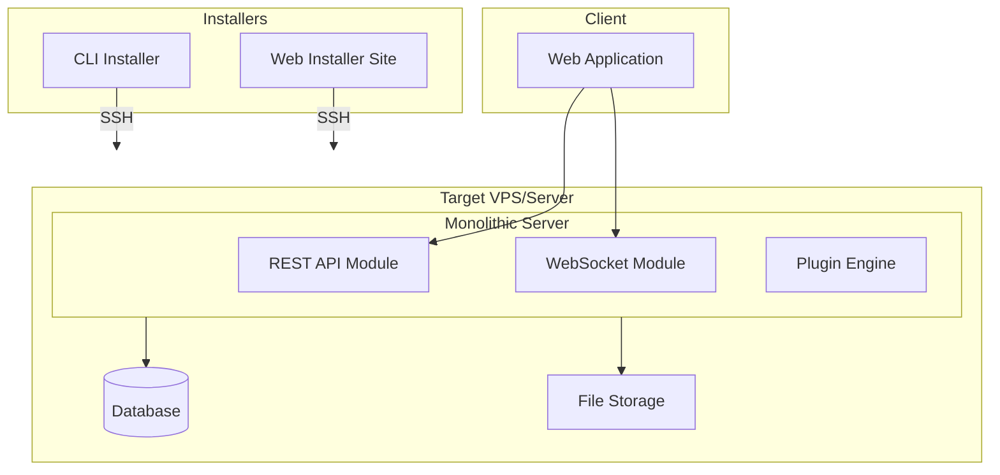
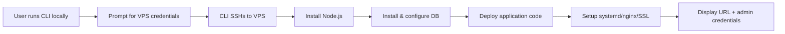
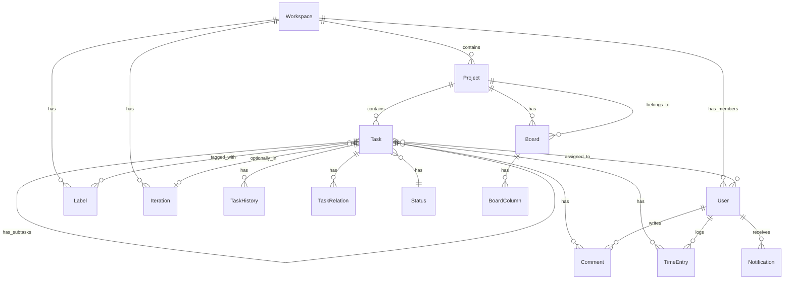
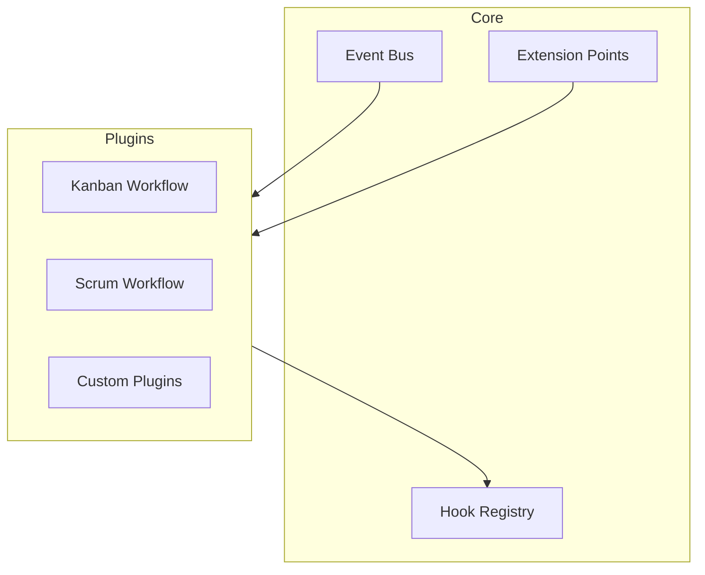

# Task Tracker - Requirements Specification

## Project Overview

**Task Tracker** - A self-hosted project management application for small-medium teams, designed as a lightweight alternative to Jira/YouTrack with emphasis on:
- Easy deployment (CLI installer + web-based installer)
- Clean, bug-free core functionality
- Plugin architecture for extensibility
- AI-ready data export capabilities (for future AI features)

**Target Users:** Small to medium development teams (2-20 people)

**Scope:** This document covers MVP requirements. AI-driven features are explicitly out of scope for initial implementation but considered in architectural decisions.

---

## Functional Requirements

### FR-1: Workspace Management
| ID | Requirement |
|----|-------------|
| FR-1.1 | Users can create multiple workspaces within a single deployment |
| FR-1.2 | Each workspace has isolated data (projects, tasks, users, settings) |
| FR-1.3 | Workspace settings include name, description, and icon/logo |
| FR-1.4 | Users can be members of multiple workspaces |
| FR-1.5 | Workspace roles: Owner, Admin, Member, Guest (read-only) |

### FR-2: Project Management
| ID | Requirement |
|----|-------------|
| FR-2.1 | Users can create projects within a workspace |
| FR-2.2 | Projects are flat (no sub-projects) |
| FR-2.3 | Project settings include name, description, color/icon |
| FR-2.4 | Projects can be archived (soft delete) |
| FR-2.5 | Each project can have custom task statuses (configurable workflow) |

### FR-3: Task Management
| ID | Requirement |
|----|-------------|
| FR-3.1 | Tasks belong to a project |
| FR-3.2 | Task fields: title, description (markdown), status, priority, assignee(s), labels, due date |
| FR-3.3 | Tasks support multiple assignees |
| FR-3.4 | Task priority levels: Critical, High, Medium, Low, None |
| FR-3.5 | Task history: all changes tracked (who, what, when) |
| FR-3.6 | Task relations: blocks, blocked by, relates to, duplicates |
| FR-3.7 | Subtasks: tasks can have child tasks (single level only) |
| FR-3.7.1 | Subtasks cannot have their own subtasks - converting a subtask to a task creates "relates to" relation with root task |
| FR-3.7.2 | Deleting task with subtasks warns user; cascade delete if confirmed |
| FR-3.8 | Task estimates: optional time estimate field |

### FR-4: Boards (Kanban)
| ID | Requirement |
|----|-------------|
| FR-4.1 | Boards display tasks grouped by status |
| FR-4.2 | Tasks can be dragged between columns (status changes) |
| FR-4.3 | Boards can be filtered by assignee, label, priority |
| FR-4.4 | Boards can be scoped to a project or show all workspace tasks |
| FR-4.5 | Column order and visibility can be customized |

### FR-5: Labels
| ID | Requirement |
|----|-------------|
| FR-5.1 | Labels are workspace-level (shared across projects) |
| FR-5.2 | Labels have name and color |
| FR-5.3 | Tasks can have multiple labels |
| FR-5.4 | Labels can be created/edited/deleted by workspace admins |

### FR-6: Comments
| ID | Requirement |
|----|-------------|
| FR-6.1 | Users can add comments to tasks |
| FR-6.2 | Comments support markdown formatting |
| FR-6.3 | Comments can mention users (@username) with notifications |
| FR-6.4 | Comments can be edited/deleted by author (no time limit) |
| FR-6.5 | Comment edit history preserved (edits tracked) |

### FR-7: Time Tracking
| ID | Requirement |
|----|-------------|
| FR-7.1 | Users can log time spent on tasks |
| FR-7.2 | Time entries have: duration, date, optional description |
| FR-7.3 | Users can start/stop timer on a task (real-time tracking) |
| FR-7.4 | Time reports: filter by user, project, date range |
| FR-7.5 | Time entries can be edited/deleted |

### FR-8: Iterations/Sprints
| ID | Requirement |
|----|-------------|
| FR-8.1 | Iterations are time-boxed periods with start/end dates |
| FR-8.2 | Tasks can be assigned to an iteration |
| FR-8.3 | Iteration views show tasks in current iteration |
| FR-8.4 | Iteration reports show planned vs completed |
| FR-8.5 | Core provides basic iterations (start/end dates, task assignment); plugin system can extend with burndown, velocity tracking |

### FR-9: Authentication & Authorization
| ID | Requirement |
|----|-------------|
| FR-9.1 | Local authentication: email/password with email verification |
| FR-9.2 | OAuth providers: Google, GitHub (configurable) |
| FR-9.3 | Password reset via email |
| FR-9.4 | Session management: view active sessions, logout |
| FR-9.6 | Role-based access control per workspace |

### FR-10: Notifications
| ID | Requirement |
|----|-------------|
| FR-10.1 | In-app notifications for: task assigned, mentioned, status changed |
| FR-10.2 | Email notifications (configurable per user) |
| FR-10.3 | Notification preferences per user |

### FR-11: Export & Reporting
| ID | Requirement |
|----|-------------|
| FR-11.1 | Export tasks to JSON (for AI/LLM consumption) |
| FR-11.2 | Export tasks to CSV |
| FR-11.3 | Export filtered data (by project, date range, assignee) |
| FR-11.4 | Dashboard with key metrics (tasks by status, velocity, etc.) |

### FR-12: Plugin System
| ID | Requirement |
|----|-------------|
| FR-12.1 | Plugin architecture for workflow engines (Kanban, Scrum, custom) |
| FR-12.2 | Plugins can extend: task fields (base fields modifiable), board views, reports |
| FR-12.3 | Plugin configuration per workspace |
| FR-12.4 | Core system works without any plugins installed |

### FR-13: Import
| ID | Requirement |
|----|-------------|
| FR-13.1 | Import tasks from CSV files |
| FR-13.2 | Import tasks from Jira JSON export |
| FR-13.3 | Field mapping configuration for imports |

---

## Non-Functional Requirements

### NFR-1: Performance
| ID | Requirement |
|----|-------------|
| NFR-1.1 | Page load time < 2 seconds on standard connection |
| NFR-1.2 | API response time < 200ms for 95th percentile |
| NFR-1.3 | Support 100 concurrent users per deployment (total across all workspaces) |
| NFR-1.4 | Board drag-and-drop latency < 100ms |

### NFR-2: Scalability
| ID | Requirement |
|----|-------------|
| NFR-2.1 | Support 10,000+ tasks per workspace |
| NFR-2.2 | Support 50+ workspaces per deployment |
| NFR-2.3 | Database queries optimized with proper indexing |

### NFR-3: Security
| ID | Requirement |
|----|-------------|
| NFR-3.1 | All data encrypted in transit (HTTPS) |
| NFR-3.2 | Passwords hashed with bcrypt/argon2 |
| NFR-3.3 | Input validation on all API endpoints |
| NFR-3.4 | Protection against XSS, CSRF, SQL injection |
| NFR-3.5 | Audit logging for sensitive operations |
| NFR-3.6 | No sensitive data in logs |

### NFR-4: Reliability
| ID | Requirement |
|----|-------------|
| NFR-4.1 | Data persistence with automatic backups |
| NFR-4.2 | Graceful error handling with user-friendly messages |
| NFR-4.3 | Zero data loss on application crash |

### NFR-5: Maintainability
| ID | Requirement |
|----|-------------|
| NFR-5.1 | TypeScript throughout (FE + BE) |
| NFR-5.2 | Monorepo structure with shared types |
| NFR-5.3 | Comprehensive API documentation |
| NFR-5.4 | Automated tests for critical paths |
| NFR-5.5 | Clear separation of concerns (layered architecture) |

### NFR-6: Deployment
| ID | Requirement |
|----|-------------|
| NFR-6.1 | CLI installer: single command to deploy to VPS |
| NFR-6.2 | Web installer: form-based deployment to VPS via SSH |
| NFR-6.3 | Automatic dependency installation (Node.js, database, etc.) |
| NFR-6.4 | Single-command updates |
| NFR-6.5 | Environment-based configuration |
| NFR-6.6 | Docker images available as alternative |

### NFR-7: Usability
| ID | Requirement |
|----|-------------|
| NFR-7.1 | Responsive design (desktop, tablet) |
| NFR-7.2 | Dark/light theme |
| NFR-7.3 | Keyboard shortcuts for common actions |
| NFR-7.4 | Accessible (WCAG 2.1 AA compliance) |

### NFR-8: Availability
| ID | Requirement |
|----|-------------|
| NFR-8.1 | 99% uptime target for self-hosted scenarios |
| NFR-8.2 | Health check endpoints for monitoring |
| NFR-8.3 | Graceful shutdown handling |

### NFR-9: Rate Limiting
| ID | Requirement |
|----|-------------|
| NFR-9.1 | Configurable API rate limits (default: 100 requests/minute per user) |
| NFR-9.2 | Rate limiting protects against abuse in self-hosted scenarios |

### NFR-10: Data Retention
| ID | Requirement |
|----|-------------|
| NFR-10.1 | Configurable data retention period by workspace admin |
| NFR-10.2 | Default: keep forever, admin can configure cleanup |
| NFR-10.3 | Applies to task history, notifications, time entries |

### NFR-11: Concurrency Control
| ID | Requirement |
|----|-------------|
| NFR-11.1 | Optimistic locking for concurrent task/board edits |
| NFR-11.2 | Version field on tasks; reject update if version mismatch |
| NFR-11.3 | User must refresh and retry on version conflict |

### NFR-12: Offline Handling
| ID | Requirement |
|----|-------------|
| NFR-12.1 | WebSocket disconnection shows offline banner |
| NFR-12.2 | Disable drag-and-drop and real-time actions when offline |
| NFR-12.3 | Re-enable actions when connection restored |

---

## System Architecture

### Architecture Overview



### Architecture Decisions

1. **Monolith Structure**: Single server process with REST API, WebSocket, and Plugin Engine modules
2. **Monorepo**: Single repository with packages for frontend, backend, shared types, and CLI tools
3. **Plugin System**: Event-based hooks and extension points for workflow customization
4. **API-First**: All operations through REST API, enabling future integrations
5. **Real-time Updates**: WebSocket for board updates, notifications

---

## Deployment Flow

### CLI Installer Flow



### Web Installer Flow

```mermaid
flowchart LR
    A[User visits installer site] --> B[Fills form: VPS IP, user, password/key]
    B --> C[Installer backend validates SSH connection]
    C --> D[Backend SSHs to VPS]
    D --> E[Install Node.js]
    E --> F[Install & configure DB]
    F --> G[Deploy application code]
    G --> H[Setup systemd/nginx/SSL]
    H --> I[Display URL + admin credentials]
```



### Installer Service Architecture

- **Static frontend**: Form for VPS credentials, progress display
- **Minimal backend**: Node.js service handling SSH connections
- **Deployment target**: Can be hosted anywhere (Vercel, own VPS, etc.)
- **Security**: Credentials never stored, connection established per-session

### Update Process
- Command: `task-tracker update` or via admin UI
- Pulls latest version, runs migrations, restarts service
- Automatic backup before migration
- Rollback capability if update fails

---

## Data Model

### Entity Relationship Diagram



### Core Entities

| Entity | Description |
|--------|-------------|
| Workspace | Top-level container, isolated tenant |
| User | System user, can belong to multiple workspaces |
| Project | Group of tasks within workspace |
| Task | Work item with title, description, status, etc. |
| Board | Kanban view configuration |
| Label | Tags for categorizing tasks |
| Iteration | Time-boxed sprint/cycle |
| Comment | Discussion on tasks |
| TimeEntry | Logged work time |
| TaskHistory | Audit trail of task changes |
| Notification | User alerts |

### Time Entry Fields

| Field | Type | Description |
|-------|------|-------------|
| id | UUID | Unique identifier |
| taskId | UUID | Associated task |
| userId | UUID | Who logged the time |
| duration | minutes | Time in minutes |
| date | date | When work was done |
| description | string? | Optional note |
| billable | boolean | For future billing features |

---

## API Overview

### Authentication Endpoints
| Method | Endpoint | Description |
|--------|----------|-------------|
| POST | /auth/register | Create account |
| POST | /auth/login | Authenticate |
| POST | /auth/logout | End session |
| POST | /auth/forgot-password | Request reset |
| POST | /auth/reset-password | Reset with token |
| GET | /auth/oauth/:provider | OAuth redirect |
| GET | /auth/oauth/:provider/callback | OAuth callback |

### Workspace Endpoints
| Method | Endpoint | Description |
|--------|----------|-------------|
| GET | /workspaces | List user workspaces |
| POST | /workspaces | Create workspace |
| GET | /workspaces/:id | Get workspace |
| PUT | /workspaces/:id | Update workspace |
| DELETE | /workspaces/:id | Delete workspace |
| GET | /workspaces/:id/members | List members |
| POST | /workspaces/:id/members | Add member |
| PUT | /workspaces/:id/members/:userId | Update role |
| DELETE | /workspaces/:id/members/:userId | Remove member |

### Project Endpoints
| Method | Endpoint | Description |
|--------|----------|-------------|
| GET | /workspaces/:id/projects | List projects |
| POST | /workspaces/:id/projects | Create project |
| GET | /projects/:id | Get project |
| PUT | /projects/:id | Update project |
| DELETE | /projects/:id | Archive project |
| GET | /projects/:id/statuses | Get custom statuses |
| POST | /projects/:id/statuses | Create status |

### Task Endpoints
| Method | Endpoint | Description |
|--------|----------|-------------|
| GET | /projects/:id/tasks | List tasks |
| POST | /projects/:id/tasks | Create task |
| GET | /tasks/:id | Get task |
| PUT | /tasks/:id | Update task |
| DELETE | /tasks/:id | Delete task |
| GET | /tasks/:id/history | Get change history |
| POST | /tasks/:id/comments | Add comment |
| POST | /tasks/:id/time-entries | Log time |
| POST | /tasks/:id/relations | Add relation |

### Board Endpoints
| Method | Endpoint | Description |
|--------|----------|-------------|
| GET | /projects/:id/boards | List boards |
| POST | /projects/:id/boards | Create board |
| GET | /boards/:id | Get board with tasks |
| PUT | /boards/:id | Update board config |

### Export Endpoints
| Method | Endpoint | Description |
|--------|----------|-------------|
| GET | /workspaces/:id/export/json | Export to JSON |
| GET | /workspaces/:id/export/csv | Export to CSV |
| GET | /workspaces/:id/reports/dashboard | Dashboard metrics |

---

## Plugin System

### Architecture



### Extension Points

| Extension Point | Description |
|-----------------|-------------|
| workflow | Define custom task lifecycle and transitions |
| task_field | Add custom fields to tasks |
| board_view | Custom board visualizations |
| report | Custom reports and dashboards |
| notification_channel | Custom notification handlers |
| import | Import from external systems |
| export | Custom export formats |

### Plugin Interface

```typescript
interface Plugin {
  name: string;
  version: string;
  hooks: {
    [event: string]: HookHandler;
  };
  extensions: {
    [point: string]: ExtensionHandler;
  };
  install(context: PluginContext): void;
  uninstall(): void;
}
```

### Core Events

| Event | When fired |
|-------|------------|
| task.created | New task created |
| task.updated | Task field changed |
| task.status_changed | Task status transitioned |
| task.assigned | User assigned to task |
| comment.added | Comment added to task |
| iteration.started | Iteration begins |
| iteration.completed | Iteration ends |
| time_entry.started | Timer started on task |
| time_entry.stopped | Timer stopped, entry created |
| time_entry.added | Manual time entry added |
| time_entry.updated | Time entry modified |
| time_entry.deleted | Time entry removed |

---

## Out of Scope (Future Phases)

| Feature | Notes |
|---------|-------|
| AI-driven features | Task auto-assignment, smart suggestions, AI reports |
| Two-factor authentication | Security enhancement |
| Mobile apps | Native iOS/Android |
| Email integration | Create tasks via email |
| Webhooks | External integrations |
| Gantt charts | Timeline views |
| Custom fields | User-defined task fields |
| Billing/invoicing | Connect time tracking to billing |
| SSO (SAML/OIDC) | Enterprise authentication |
| Advanced permissions | Field-level permissions |
| Roadmap planning | Strategic planning features |
| Custom themes | UI theming beyond dark/light |

---

## Success Criteria

| Metric | Target |
|--------|--------|
| Deployment time | < 10 minutes from zero to running |
| First task creation | < 5 minutes after deployment |
| Documentation coverage | All endpoints documented |
| Test coverage | > 80% on critical paths |
| Lighthouse score | > 90 for performance, accessibility |
